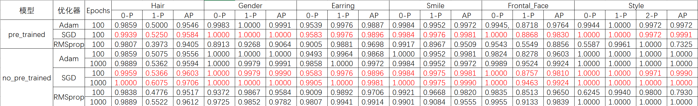

# Human Face Attributes Recognition(HFAR)
> 深度学习课程作业，为防重同窗请勿直接使用，Author: ZHS-Houzss，问题咨询联系(houzss1@gmail.com)

> Deep learning coursework, to prevent plagiarism, classmates should not use it directly, Author: ZHS-Houzss, contact for inquiries (houzss1@gmail.com)

> 数据集来自[FS2K](https://github.com/DengPingFan/FS2K)

> 针对素描人像的属性识别任务构建的基于Pytorch, Sklearn, Numpy及Pandas等框架的网络模型

> Dataset from [FS2K](https://github.com/DengPingFan/FS2K)

> A network model based on frameworks such as Pytorch, Sklearn, Numpy and Pandas built for the attribute recognition task of sketch portraits


### Introduction:

基于FS2K数据集的素描人像数据，使用Pytorch框架实现了Resnet18网络模型结构，针对不同属性定义并行的线性全连接层，使用Softmax实现归一化，也即类型概率预测。

Based on the sketch portrait data of the FS2K dataset, I used the Pytorch framework to implement the Resnet18 network model structure, defined parallel linear fully connected layers for different attributes, and used Softmax to achieve normalization, that is, type probability prediction.

整个框架文件结构如下所示：

The entire framework file structure is as follows:

文件夹HFAR下含data，model和tool三个子文件夹。data文件夹包含了从FS2K中整合的图片数据和训练、测试集属性标注文件；model文件夹包含了使用nn.module类实现的Resnet18残差网络模型结构；tool文件夹包含了本套件使用到的代码文件，data_prepare.py用于从FS2K数据集中整合成本套件所需的数据集（即生成data文件夹下所有数据文件），datasets.py实现定制DataSets类型供模型使用，train.py用于模型训练测试，train.sh用于在shell环境下比较不同优化器和模型有无预训练参数对精度的影响，utils.py包含了定制的DataLoader类，评估模型用的各项指标如Precision, Average Precision 和mAP，混淆矩阵等。

The folder HFAR contains three subfolders, data, model and tool. The data folder contains the image data and training and test set attribute annotation files integrated from FS2K; the model folder contains the Resnet18 residual network model structure implemented using the nn.module class; the tool folder contains the tools used in this suite The code file, data_prepare.py is used to integrate the datasets required by the cost suite from the FS2K dataset (that is, to generate all data files in the data folder), datasets.py implements custom DataSets types for model use, train.py is used for model training For testing, train.sh is used to compare the impact of different optimizers and models with or without pre-training parameters on the accuracy in the shell environment, utils.py contains a custom DataLoader class, which evaluates various indicators used by the model such as Precision, Average Precision and mAP, Confusion Matrix, etc.

```
HFAR
├── data
│       ├── train       (Directory:1058 Sketch Images)
│       ├── test        (Directory:1058 Sketch Images)
│       ├── test_anno.csv
│       └── train_anno.csv
├── model
│       ├── ResNet.py   (Resnet18 Model)
├── tool
│       ├── data_prepare.py (prepare datasets from FS2K)
│       ├── datasets.py     (custom datasets)
│       ├── train.py        (Task training codes)
│       ├── train.sh        (Task training shell codes)
│       └── utils.py        (DataLoader, Evaluation codes)      
└── README.pdf
```

### Python/Conda Module Requirements(套件模块依赖)
```
Pytorch==1.9.0
torchvision==0.10.0
numpy==1.22.3
pandas==1.3.4
sklearn==1.0.1
matplotlib==3.4.3
argparse==1.1
```

### Attributes

我们从FS2K标注的多项属性中提取出Hair,Gender,Earring,Smile,Frontal_Face,Style共六类属性作为本套件的六项识别任务，具体标注如下：

We extract Hair, Gender, Earring, Smile, Frontal_Face, Style from the attributes marked by FS2K as the six recognition tasks of this suite. The specific annotations are as follows:


#### Annotations

```python
[{
	"image_name": "train/0001.jpg",

	"hair": 0,
	# 0: with hair, 1: without hair.

	"gender": 0,
	# 0: male, 1: female.

	"earring": 1,
	# 0: with earring, 1: without earring.

	"smile": 1,
	# 0: with smile, 1: without smile.

	"frontal_face": 1,
	# 0: head rotates within 30 degrees, 1: > 30 degrees

	"style": 0
	# Style = one of {0, 1, 2}, please refer to the sketch samples.
},
...
]
```

#### Attributes Count

|   FS2K    | w/ H | w/o H |  M   |  F   | w/ E | w/o E | w/ S | w/o S | w/ F | w/o F |  S1  |  S2  |  S3  | Count |
| :-------: | :--: | :---: | :--: | :--: | :--: | :---: | :--: | :---: | :--: | :---: | :--: | :--: | :--: | :---: |
| **Train** | 1010 |  48  | 574  | 484  | 209  |  849  | 645  |  413  | 917  |  141  | 357  | 351  | 350  | 1058 |
| **Test**  | 994  |  52  | 632  | 414  | 187  |  859  | 670  |  376  | 872  |  174  | 619  | 381  |  46  | 1058 |

+ H = **头发可见**与否。
+ **性别**：男/女。
+ E = 带**耳环**或不带耳环。
+ S = 带**微笑**或不带微笑。
+ F = **正面面部** 或面部 > 30 度。
+ S (1 / 2 / 3) = **风格**1 / 风格2 / 风格3。
+ Count = 数据集个数


+ H = **Hair Visible** or not.
+ **Gender**: Male / Female.
+ E = With **Earring** or without Earring.
+ S = With **Smile** or without Smile.
+ F = **Frontal Face** or Face > 30 degrees.
+ S (1 / 2 / 3) = **Style**1 / Style2 / Style3.
+ Count = number of datasets

### Tools

+ 将 *FS2K 数据集* 放在此文件夹中。
+ 运行 `tool/data_prepare.py` 将整个数据集拆分为训练部分和测试部分。
+ 运行 `tool/train.py` 来训练模型并获得测试结果。

+ Put the *FS2K dataset* in this folder.
+ Run `tool/data_prepare.py` to split the whole dataset into training part and test part.
+ Run `tool/train.py` to train the models and get test result.

##### 注：如果要运行train.sh文件，需先在主目录下建立result和tmp文件夹。result下应包含no_pre_trained和pre_trained两个文件夹，且这两个文件夹下应都有Adam,RMSprop,SGD三个子文件夹；tmp下应包含存放训练模型的文件夹model_param
##### Note: If you want to run the train.sh file, you need to create the result and tmp folders in the main directory first. The result should contain two folders no_pre_trained and pre_trained, and there should be three subfolders Adam, RMSprop, SGD under these two folders; tmp should contain the folder model_param for storing the training model

### Training Result
我对有无预训练的Resnet18网络模型分别采用Adam、SGD和RMSprop三种不同优化器训练100个epoch（其中未预训练的Resnet18网络模型训练1000个epoch），结果为：



1、SGD随机梯度下降优化器对本次素描肖像人脸属性识别任务更合适，无论是pre_trained过的Resnet18模型使用3种优化器训练100个epoch的精度结果还是no_pretrained过的Resnet18模型经100和1000个epoch的精度结果，SGD的精度总是最高。(分析原因：数据集小，SGD更适用)

2、从有无经过预训练的Resnet18模型训练100个epoch的精度对比上看，没有经过预训练的模型在100个epoch后也能达到高精度分类结果(分析原因：数据集简单)

### 参考文献

1、[He K , Zhang X , Ren S , et al. Deep Residual Learning for Image Recognition[J]. IEEE, 2016.](https://arxiv.org/abs/1512.03385)

2、WELCOME TO PYTORCH TUTORIALS, https://pytorch.org/tutorials/

3、AP和mAP 计算, https://blog.csdn.net/mr_muli/article/details/101616406

4、利用python绘制混淆矩阵, https://blog.csdn.net/weixin_43818631/article/details/121309660

5、PyTorch实现ResNet18, https://blog.csdn.net/weixin_36979214/article/details/108879684

6、Python中的format方法, https://blog.csdn.net/a1786742005/article/details/89388093

7、Python使用 plt.savefig 保存图片时是空白图片怎么解决, https://blog.csdn.net/tianxinyiru/article/details/121403165